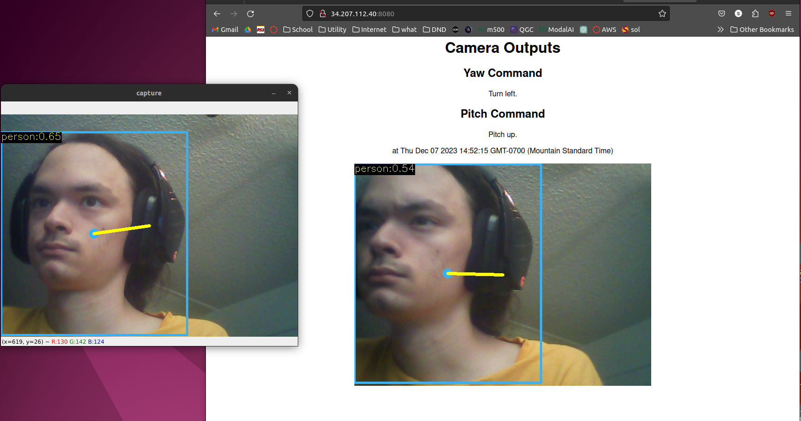

# User Guide

## Hardware
Connect a USB webcam to either a PC running Ubuntu or a Raspberry Pi

### For Webcam connected to PC (Use Ubuntu OS)
- Install Python, at least version 3.10
- Run `pip3 install requests opencv-python numpy os platform`
- Open Face_Detector_PC.py and change IP address on line 159. (Finish "Startup EC2" steps below first)
- Run Face_Detector_PC.py and verify connection to server (Finish "Running the Server" steps below first)

### For Webcam connected to Raspberry Pi

## Startup EC2

- Create EC2 instance on AWS Academy, Ubuntu 20.04.
- Configure security settings to 
    1. SSH traffic to port 22 (default)
    2. All TCP traffic to port 8080
    3. TCP traffic to port 21017 from your IP (optional)
- Launch instance

## In the instance
### Initial
Run the following commands

`curl -s https://gist.githubusercontent.com/tejaswigowda/f289e9bff13d152876e8d4b3281142f8/raw/df37df2e16a3166e686357a045751a7c18bbeebe/installNodeMongoUbuntu16.04.sh | bash`

`sudo npm install -g n`

`sudo npm install -g http-server`

`git clone https://github.com/MaxlGao/AME598_Project.git`

`sudo service mongod start`

`sudo nano /etc/mongod.conf`

### In mongodb.conf:

Change bindIP to 0.0.0.0

### Running the Server:

If changing security settings, or if mongocompass isnt behaving: 

`sudo service mongod restart` 

Additionally:

`sudo npm install mongoskin`

`sudo npm install mongodb@^2.0`

`cd AME598_Project/server`

`node server.js`

To configure the server: 

`sudo nano server.js`

To fully shut down the server:

`ps`

Then

`pkill -9 [NODE PROCESS ID]`

## On a Browser

Go to `http://[AWS-generated IP]:8080`

If the connection is functioning properly, you should see something like this:

